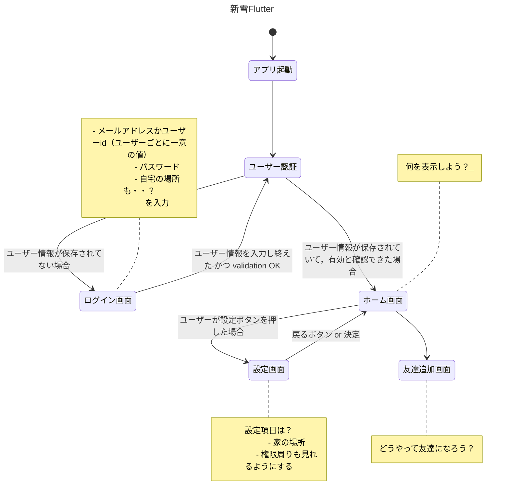
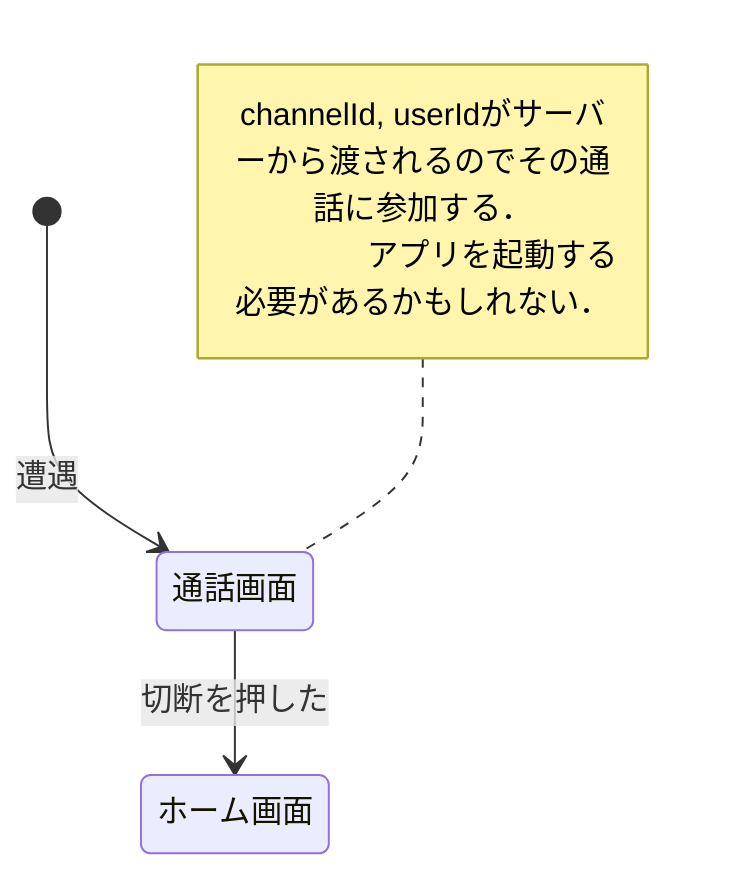

# Flutter画面遷移図
## アプリを開いた時

```mermaid
---
title: 新雪Flutter
---
stateDiagram-v2
	[*] --> アプリ起動
	アプリ起動 --> ユーザー認証
	ユーザー認証 --> ログイン画面 : ユーザー情報が保存されてない場合
	note left of ログイン画面
		- メールアドレスかユーザーid（ユーザーごとに一意の値）
		- パスワード
		- 自宅の場所も・・？
		を入力
	end note
	ログイン画面 --> ユーザー認証 : ユーザー情報を入力し終えた かつ validation OK
	ユーザー認証 --> ホーム画面 : ユーザー情報が保存されていて，有効と確認できた場合
	note left of ホーム画面
		何を表示しよう？_
	end note
	ホーム画面 --> 設定画面 : ユーザーが設定ボタンを押した場合
	note right of 設定画面
		設定項目は？
		- 家の場所
		- 権限周りも見れるようにする
	end note
	設定画面 --> ホーム画面 : 戻るボタン or 決定
	ホーム画面 --> 友達追加画面
	note right of 友達追加画面
		どうやって友達になろう？
	end note
```
## 遭遇した時

```mermaid
stateDiagram-v2
	[*] --> 通話画面 : 遭遇
	note left of 通話画面
		channelId, userIdがサーバーから渡されるのでその通話に参加する．
		アプリを起動する必要があるかもしれない．
	end note
	通話画面 --> ホーム画面 : 切断を押した
```
## バックグラウンド処理
---サーバーに送信---
- 位置情報
- アプリの使用状況
- スマホのむき

---サーバーから取得---
- 遭遇したか（誰と？）
# Reference

